# Gn-Terminal

## 简介

一个Linux终端风格的web首页，集成了多种功能。通过输入命令来使用这些功能。
  
* 基本实现终端操作，包括命令提示、历史命令、快捷键、帮助手册、清屏、ping等
* 集成多种小功能，包括多种搜索、书签收藏夹、计时器、网易云音乐热榜、bilibili热榜等
* 系统设计容易扩展和维护，方便扩展新命令


系统结构




## 技术栈

**前端**：
* Vue3 
* TypeScript 
* Pinia 
* Ant Design Vue
* Vite

**后端**：
* Express
* Sequelize

## 操作指南

### 快捷键

* `↑` : 上一条历史命令
* `↓` : 下一条历史命令
* `Enter`、`Backspace` : 聚焦输入框
* `Tab` : 命令补全
* `Ctrl` + `L` : 清屏
* `Ctrl` + `O` : 折叠

### 命令

可以在终端中输入 `help 命令名`，查看命令的详细使用方法

```
- 操作终端相关命令
    - hint              命令提示控制，切换提示开启与关闭
    - history           查看历史命令
    - clear             清屏
    - help              帮助
    - ping              检测某个地址是否存活
    - background        切换终端背景
- 搜索相关命令
    - baidu             进行百度搜索
    - google            进行谷歌搜索
    - bing              进行必应搜索
    - baidudev          进行百度开发者搜索
    - googlescholar     进行谷歌学术搜索
    - zhihu             知乎搜索
    - douban            豆瓣搜索
    - juejin            掘金搜索
    - github            github搜素
    - stackoverflow     stackoverflow 搜索
    - wangyiyun         网易云搜索
    - mdn               MDN搜索

- 书签收藏夹命令，模仿Linux文件操作
    - add               增加书签
    - list              查看当前目录文件和文件夹
    - mkdir             新建文件夹
    - cd                移动到指定目录
    - pwd               查看当前目录
    - remove            删除书签
    - copy              复制书签
    - move              移动书签

- 用户相关操作
    - uploadfavor       同步书签到服务器
    - downloadfavor     同步服务器书签到本地
    - login             用户登录
    - logout            用户注销
    - regist            用户注册

- 一些小功能
    - timer             开启一个定时器，倒计时指定的秒数
    - music             在线听音乐，网易云音乐
    - hot               网易云热榜音乐
    - hotvideo          bilibili视频热榜
```
